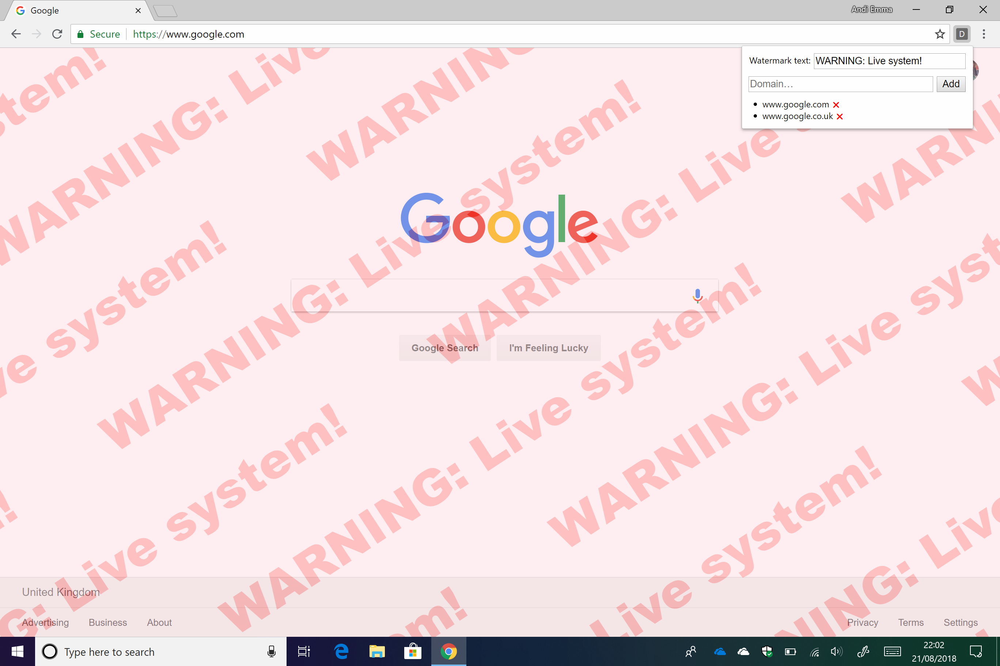

#  Chrome Domain Watermarker

## Overview

This is a Google Chrome extension which overlays a watermark on top of websites hosted on one of a configurable set of domains. The primary motivation for this plugin is for web developers and testers to be able to automatically remind themselves when interacting with live systems, so they don’t accidentally modify live data. I’d be interested to hear if anyone finds any other particularly useful or interesting use cases for this tool!

## Status

**Alpha release available!** I’ve implemented what I feel is a suitable MVP for the extension, as _v0.1_. Please do try it out and let me know what you think or if you want to contribute to development.

At this stage, I’m interested in alpha testers, usability feedback, code critique and feature ideas. The simplest way to give said feedback is probably by creating an issue on the repository. This also means I can use the issue list to track work that needs doing and action it.

## Installing

Until v1 is ready (at which point I’ll publish the extension on the Chrome Web Store), the plugin will need adding to your browser manually. Follow these steps to get it up-and-running:

1. Clone the repo to your local machine.
2. In Chrome, open the main menu (vertical ellipsis icon).
3. Navigate to _[More tools > Extensions]_.
4. Flip the _“Developer mode”_ switch.
5. Click _“Load unpacked”_ and choose the repo root.
6. The extension icon should now appear to the right of the omnibox.
7. Click the icon to change the watermark text and add domains to watermark.

## Roadmap

I don’t have a formal roadmap for future development yet, but these are some of the features I’d like to introduce at some point – let me know if you have any you think would be worth adding/prioritising:

* Configurable overlay colour and opacity.
* Per-domain watermark text and colour.
* Multiple font choices.
* Properly-designed UI and branding.
* Free version (v1) and premium/pro version w/ more features (v2).
* Roaming settings.
* Microsoft Edge port (uses same extension system).

## Credits

**Author:** Andi Emma Davies ([@andidavies92](https://www.github.com/andidavies92))

_Poke me via an issue if you’re interested in contributing._

## Licence

**Copyright © Stack-in-a-box Software 2018**

All rights reserved _(I’ll sort a proper licence before official release…)_
